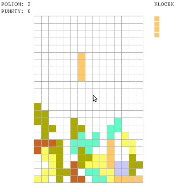

# Tetris

## Description / Opis

This is another remake of the classic arcade game Tetris. 
Drop the blocks in this classic arcade puzzle game to make lines.

To jest kolejny remake klasycznej gry arcade: Tetris.
Zrzucaj klocki, żeby tworzyć linie.

## Extra features / Extra funkcjonalności
* You can select level to start. Remember, the higher the level, the more points for creating the line
* You can mute music if you dont like it
* You can save and load state of game. Just click `WCZYTAJ` or `ZAPISZ` and resume game.
####

* Możesz wybrać poziom od którego startujesz. Pamiętaj im większy poziom tym więcej punktów za stworzenie lini.
* Możesz wyciszyć muzykę jeśli jej nie lubisz
* Możesz zapisać i wczytaj stan gry. Po prostu klikniej `WCZYTAJ` lub `ZAPISZ` i wznów grę.

## How to run? / Jak uruchomić?

Before start you need installed python3.5 and pygame. 
Command: `python 3.5 ./game.py` (inside tetris directory)

Przed rozpoczęciem zainstaluj python3.5 i pygame.
Komenda: `python3.5 ./game.py` (wewnątrz katalogu tetris)

## Keyboard / Klawiszologia

* `space` - rotate a block / obróć klocek
* `left arrow` - move block to left / przesuń w lewo
* `right arrow` - move block to right / przesuń w prawo
* `p` - pause/unpause game / pauza/odpauzowanie
* `esc` - go to menu / przejdź do menu
